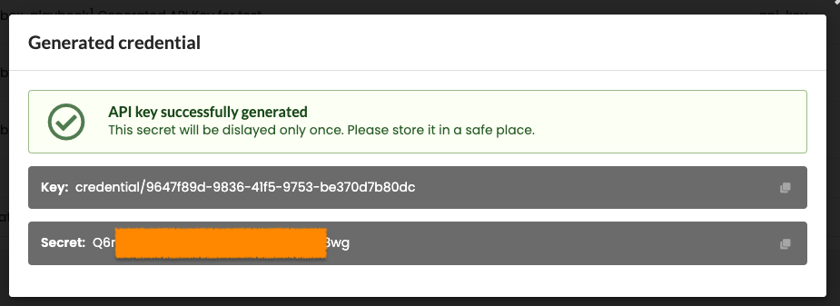

# ICOS Agent Deployment Manager with Nuvla driver

This is ICOS Agent Deployment Manager with Nuvla driver. This service connects
to ICOS Controller Job Manager to retrieve application deployment definitions
targeting Cloud and Edge resource available via Nuvla. It then launches the
requested applications on the target resources.

## Starting

```shell
./dm.py
```
or
```shell
./dm.py /path/to/config.file
```

## Configuration

Below is an example configuration file that is expected by the Deployment
Manager. Unless provided as the fist positional argument to the Deployment
Manager CLI, by default, the configuration file is expected under the following
path `/etc/icos/dm.conf`.

```ini
[keycloak]
url = https://keycloak.dev.icos.91.109.56.214.sslip.io/realms/icos-dev/protocol/openid-connect/token
client_id = nuvla-deployment-manager
client_secret = secret
grant_type = client_credentials

[jm]
url = http://10.160.3.20:30200

[nuvla]
url = https://nuvla.io
api_key = credential/xyz
api_secret = secret
debug = False
```

### Nuvla API key/secret

To get Nuvla API key/secret login to https://nuvla.io and switch group
to `ICOS`. After that select `Credentials` tab on the left and then, click on 
`+Add` and select `Api-Key Nuvla.` from the menu. 


Give the API key/secret a name and description and click `create`. You will have 
to copy the generated `Key` to `api_key` and `Secret` to `api_secret` 
under `[nuvla]` in the `dm.conf` file.


